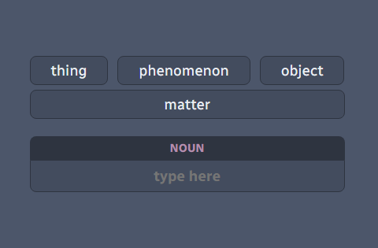
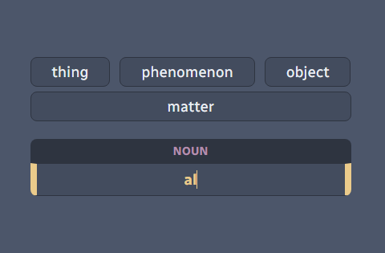
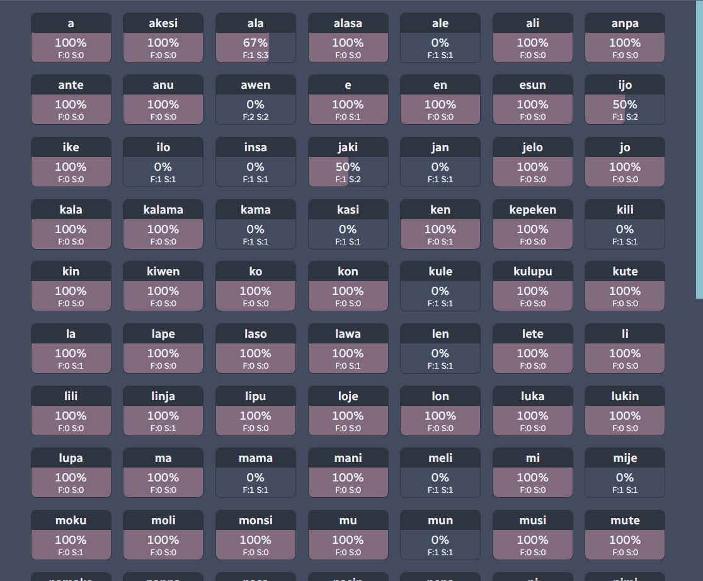

# kamasona

A terribly simple flashcard/word grinding webapp for teaching yourself [toki pona](https://tokipona.org/) ([Wikipedia](https://en.wikipedia.org/wiki/Toki_Pona)), the world's smallest language. Made with Vue3 in order to help me learn them both.

## About

You move on to the next word automatically as soon as you type in the full (and correct) answer (or any one of them if there's more than one). Otherwise, you can press `[Enter]` at any time to give up and show the answer(s).

You can view your statistics (i.e. mastery/retention) of the words by pressing and holding the `[Tab]` key. `F` is how many times you've failed the word and `S` is how many times you've seen it in total. The percentage is simply `F/S * 100`.

The `@/src/assets/dictionary.json` file is a parsed and slightly re-formatted version of [the dictionary](http://tokipona.net/tp/janpije/dictionary.php) that's available on the official toki pona site.

## Project setup

### Install dependencies
```bash
npm install
```

### Compile and hot-reload for development
```bash
npm run serve
```

### Compile and minify for production
```bash
npm run build
```

## Screenshots






